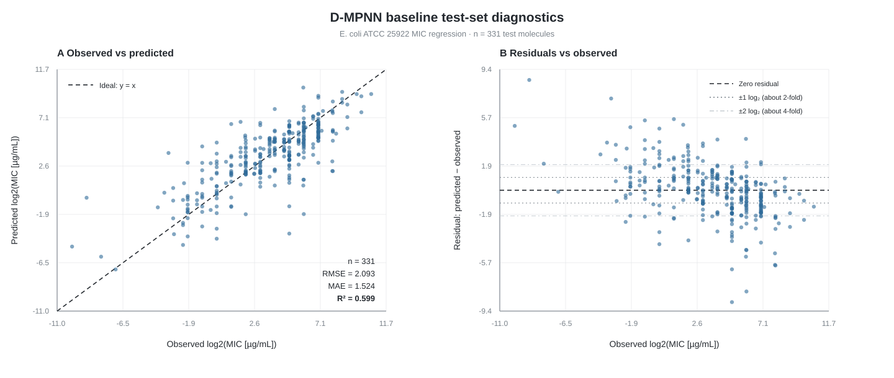

# *E. coli* MIC 回归 Baseline 实验总结

## 技术总结

本实验使用 Chemprop v2.3.1 建立了一个以分子结构预测 *Escherichia coli* ATCC 25922 最低抑菌浓度（MIC）的回归 baseline。模型输入为 `canonical_smiles`，监督学习目标为 `log2_mic = log2(MIC [μg/mL])`，模型架构为：

```text
canonical_smiles
      │
      ▼
BondMessagePassing（D-MPNN）
      │
      ▼
MeanAggregation
      │
      ▼
RegressionFFN（MLP）
      │
      ▼
predicted log2_mic
```

100 epoch 是训练上限，并不代表模型实际训练了100轮。Early Stopping 在第66轮终止训练，最佳 checkpoint 出现在第51轮。最佳模型在331个测试分子上的结果为 `RMSE = 2.0926`、`MAE = 1.5240`、`R² = 0.5995`。该结果显著优于始终预测训练集均值的无学习基线（`R² ≈ 0`），说明 D-MPNN 已经学习到分子结构与 MIC 之间的有效关系；但实验异质性、极端标签、区间型 MIC 和有限样本量限制了测试集性能。


## 数据、任务与划分

| 项目 | 设置 |
|---|---|
| 数据文件 | `experiments/data/chembl_ecoli_MIC_clean_3296.csv` |
| 总记录数 | 3,296 |
| 分子结构列（输入 X） | `canonical_smiles` |
| 回归标签（目标 y） | `log2_mic` |
| 原始 MIC | `standard_value`，单位为 μg/mL |
| 划分方式 | `RANDOM` |
| 划分比例 | 80% / 10% / 10% |
| 训练集 | 2,636 |
| 验证集 | 329 |
| 测试集 | 331 |
| 随机种子 | 42 |

`log2_mic` 是连续回归标签，而不是分类标签，因此本实验不使用 accuracy。主要性能指标为 RMSE、MAE 和 R²。

目标标准化仅使用训练集拟合；验证集使用训练集得到的标准化参数，测试集保留原始 `log2_mic` 尺度用于最终评价，从而避免由验证集或测试集信息造成的数据泄漏。

## 模型与训练配置

| 参数 | 数值 |
|---|---:|
| D-MPNN hidden dimension | 300 |
| D-MPNN depth | 3 |
| Aggregation | `MeanAggregation` |
| FFN hidden dimension | 300 |
| FFN hidden layers | 1 |
| Dropout | 0.0 |
| Batch size | 64 |
| Epoch上限 | 100 |
| Early Stopping patience | 15 |
| Accelerator | CPU |
| Num workers | 0 |

`ffn_num_layers = 1` 在 Chemprop v2 中表示一个300维隐藏层后连接输出层，并非单纯的线性回归：

```text
300维分子表示 → Linear(300, 300) → ReLU → Linear(300, 1)
```

## 100轮运行在第51轮达到最佳验证性能

下面列出 `logs/version_4/metrics.csv` 中的代表性训练阶段。训练 loss 和 validation loss 是标准化标签尺度上的均方误差；validation R²用于展示泛化性能变化。

| Epoch | Train loss | Validation loss | Validation R² |
|---:|---:|---:|---:|
| 1 | 0.9745 | 1.0188 | 0.0703 |
| 5 | 0.5946 | 0.7076 | 0.3543 |
| 10 | 0.4872 | 0.5915 | 0.4602 |
| 20 | 0.3061 | 0.3677 | 0.6645 |
| 30 | 0.2280 | 0.3187 | 0.7092 |
| 40 | 0.1716 | 0.3115 | 0.7158 |
| 50 | 0.1498 | 0.3005 | 0.7258 |
| **51（最佳）** | **0.1384** | **0.2867** | **0.7383** |
| 56 | 0.1360 | 0.2926 | 0.7330 |
| 61 | 0.1209 | 0.3041 | 0.7225 |
| 66（停止） | 0.1238 | 0.3064 | 0.7204 |

第51轮之后，训练 loss 继续下降，但 validation loss 上升、validation R²下降。这表明模型开始过拟合。Early Stopping 在连续15轮没有产生更优 validation loss 后，于第66轮停止训练，并正确保留第51轮模型：

```text
checkpoints/best-epoch=50-val_loss=0.2867.ckpt
```

文件名中的 `epoch=50` 使用从0开始的编号，对应人类计数的第51轮。

## 增加训练轮数带来了持续但逐渐减弱的改善

同一输出目录中保留了早期5、10、20和30轮运行的历史日志。它们使用相同数据、随机种子和基本架构，可用于观察训练时间的影响。

| Epoch上限 | 测试 RMSE | 测试 MAE | 测试 R² |
|---:|---:|---:|---:|
| 5 | 2.7664 | 2.1700 | 0.3001 |
| 10 | 2.6721 | 2.0559 | 0.3470 |
| 20 | 2.4502 | 1.8345 | 0.4510 |
| 30 | 2.2661 | 1.6907 | 0.5304 |
| 100上限（第51轮最佳） | **2.0926** | **1.5240** | **0.5995** |

R²随训练增加由0.300提升到0.599，证明较早运行主要存在欠拟合。但100轮运行已经由 Early Stopping 找到性能峰值，继续单纯增加 epoch 不太可能使测试 R²达到0.8。

## 最终测试结果

最佳 checkpoint 在331个测试分子上的指标为：

| 指标 | 数值 | 解释 |
|---|---:|---|
| RMSE | 2.0926 | 对较大误差和极端样本更敏感 |
| MAE | 1.5240 | 平均绝对误差为1.524个 log₂单位 |
| R² | 0.5995 | 解释约59.95%的测试集标签方差 |
| 中位绝对误差 | 1.1356 | 一半样本的绝对误差不超过约1.14个 log₂单位 |
| 误差不超过1个 log₂单位 | 45.6% | 预测 MIC 在真实值约2倍范围内 |
| 误差不超过2个 log₂单位 | 74.9% | 预测 MIC 在真实值约4倍范围内 |

由于模型训练和评价的目标是 `log2_mic`，一个 log₂单位的误差表示 MIC 相差2倍，两个 log₂单位表示相差4倍。上述倍数解释用于帮助理解误差尺度，不应被误读为原始 MIC 空间中的对称误差。

作为参考，如果对所有测试分子始终预测训练集平均 `log2_mic`，则得到：

```text
RMSE = 3.3118
MAE  = 2.6323
R²   ≈ -0.0031
```

因此，D-MPNN baseline 明显优于无学习的均值预测器。

## 测试集预测与残差图



左图比较真实 `log2_mic` 与预测 `log2_mic`，虚线 `y = x` 表示完全正确的预测。右图中的残差定义为：

```text
residual = predicted log2_mic - observed log2_mic
```

因此，正残差表示模型高估 MIC，负残差表示模型低估 MIC。右图的 `±1` 和 `±2` 参考线分别对应约2倍和4倍 MIC 差异。

散点显示出一定的向均值收缩现象：极低的真实 MIC 更容易被高估，较高的真实 MIC 更容易被低估。这与分布尾部样本较少、平方损失倾向于学习条件均值以及跨 assay 标签噪声相符，但该图本身不能证明其中任何单一因素是因果原因。

## 测试 R²低于验证 R²的主要原因

### 1. 少数极端样本主导平方误差

测试集中误差最大的5个样本贡献约20.8%的总平方误差，误差最大的10个样本贡献约31.6%。由于 R²和RMSE都基于平方误差，少数预测偏差非常大的分子会显著降低整体指标。

测试集中 `log2_mic ≤ -4` 的极低 MIC 分子只有5个，其平均绝对误差达到3.72个 log₂单位。此类标签位于数据分布尾部，训练样本稀少，模型容易将预测收缩到更常见的中间范围。

### 2. 数据来自多个 assay 和文献

清洗后的记录仍来自约305个 assay 和293篇文献。虽然菌种、菌株、指标、单位、关系和主要实验方法已经统一，不同文献之间仍可能存在培养时间、培养基、接种量、终点判定和实验室操作差异。

当前模型只接收分子结构，不接收 assay 条件。因此，无法由分子结构解释的实验差异会成为标签噪声，并限制模型可达到的最高 R²。

### 3. 仍有区间型 MIC 记录

当前3,296条数据中有51条 `upper_value` 非空，说明文献原始结果可能是一个范围，而不是严格的单点 MIC。测试集中包含9条此类记录，其单独评价结果为：

```text
RMSE = 2.3279
MAE  = 2.0132
R²   = -0.6220
```

排除这9条测试记录后，其余322条精确记录的 R²为0.6063。区间标签会降低结果质量，但并不是测试 R²未达到0.8的唯一原因。正式实验前应考虑在数据清洗阶段排除所有 `upper_value` 或 `standard_upper_value` 非空的记录，然后重新建立所有模型的共同数据划分。

### 4. 单次随机划分存在统计波动

最佳 validation R²为0.7383，而 test R²为0.5995。验证集和测试集各约占数据的10%，单次随机划分可能使测试集包含更多极端或难预测结构。

这一差距不说明测试计算错误，但说明单一 seed 的结果具有不确定性。若时间允许，正式报告应使用多个随机种子，并报告测试指标的均值和标准差。

### 5. 第51轮后出现过拟合

训练 loss 在第51轮后继续下降，而验证性能下降，说明模型进一步记忆训练集并没有改善泛化。增加 epoch 只能解决早期欠拟合，不能解决实验噪声、数据尾部稀疏或分布差异。

## 对结果的正确定位

本实验应被表述为一个成功且具有预测能力的回归 baseline，而不是高精度最终模型：

- 训练、验证、checkpoint选择和测试流程均已跑通；
- 模型显著优于训练集均值预测；
- 增加训练轮数带来稳定改善；
- Early Stopping 正确识别了开始过拟合的位置；
- 测试 R²约为0.60，仍有进一步改进空间；
- 不能根据单一测试集反复调参，直到测试 R²达到预设阈值，否则会产生测试集信息泄漏。

## 后续 Attention 对照实验

下一阶段建议比较：

```text
Baseline
BondMessagePassing → MeanAggregation → RegressionFFN

Attention variant
BondMessagePassing → AttentiveAggregation → RegressionFFN
```

Attention 实验应保持以下条件与 baseline 完全一致：

- 相同输入列 `canonical_smiles`；
- 相同目标列 `log2_mic`；
- 直接复用本目录的 `splits.csv`；
- 相同 D-MPNN hidden dimension 和 depth；
- 相同 RegressionFFN；
- 相同 batch size、epoch上限、patience 和 seed；
- 唯一结构变化为 `MeanAggregation → AttentiveAggregation`。

应同时比较 `ΔRMSE`、`ΔMAE` 和 `ΔR²`，而不应只判断 Attention 是否达到某个绝对 R²阈值。若后续重新清洗区间 MIC，则 baseline 和 Attention 必须同时在新数据和新固定划分上重新训练，不能将不同数据版本的结果直接比较。

## 本目录中的结果文件

| 文件或目录 | 内容 |
|---|---|
| `config.json` | 当前100 epoch上限实验的参数、版本和最佳 checkpoint 路径 |
| `metrics.json` | 当前最佳模型的测试集 RMSE、MAE和R² |
| `splits.csv` | 每条原始数据的 train/validation/test 分配 |
| `test_predictions.csv` | 测试集真实 `log2_mic` 与预测值 |
| `baseline_diagnostics.svg` | 透明背景矢量图：真实值–预测值及真实值–残差诊断 |
| `best_model.pt` | 保存后的最佳 Chemprop 模型 |
| `checkpoints/best-epoch=50-val_loss=0.2867.ckpt` | 当前100 epoch实验的最佳 Lightning checkpoint |
| `logs/version_4/metrics.csv` | 当前100 epoch实验的逐轮训练、验证和测试日志 |
| `logs/version_0` 至 `version_3` | 早期5、10、20和30轮运行的历史日志 |

读取当前最终 baseline 时，应以 `config.json`、`metrics.json`、`test_predictions.csv`、`best_model.pt`、上述最佳 checkpoint 和 `logs/version_4` 为准；其他版本目录仅用于训练过程对比。


``` text
python experiments/baseline.py `
  --data-path experiments/data/chembl_ecoli_MIC_clean_3296.csv `
  --smiles-column canonical_smiles `
  --target-columns log2_mic `
  --output-dir experiments/outputs/baseline_smoke `
  --split-type RANDOM `
  --split-sizes 0.8 0.1 0.1 `
  --seed 42 `
  --epochs 100 `
  --patience 15 `
  --batch-size 64 `
  --num-workers 0 `
  --message-hidden-dim 300 `
  --depth 3 `
  --ffn-hidden-dim 300 `
  --ffn-num-layers 1 `
  --dropout 0.0 `
  --accelerator cpu
```
